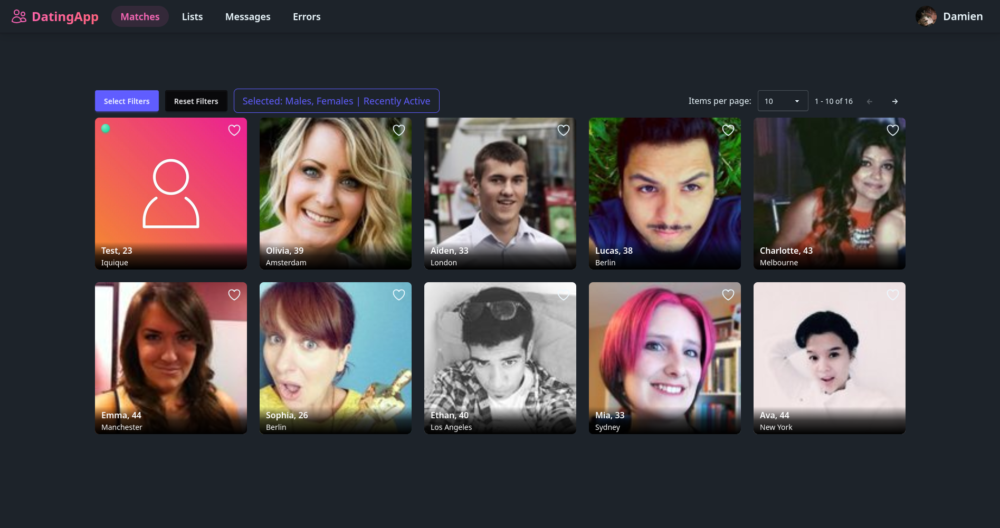
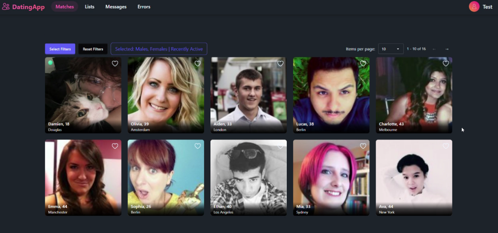
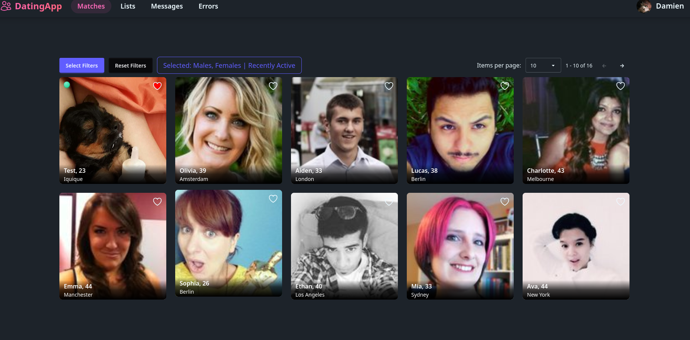
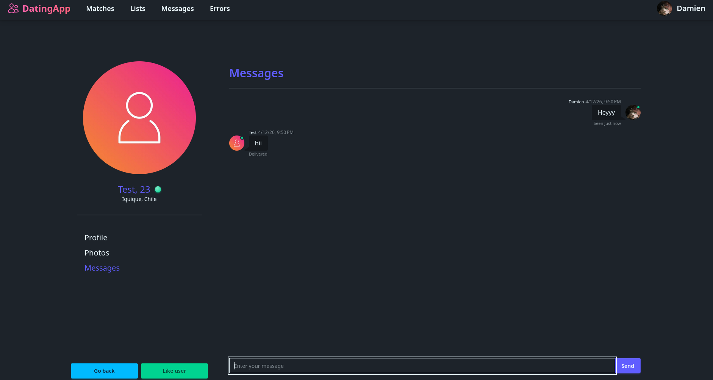
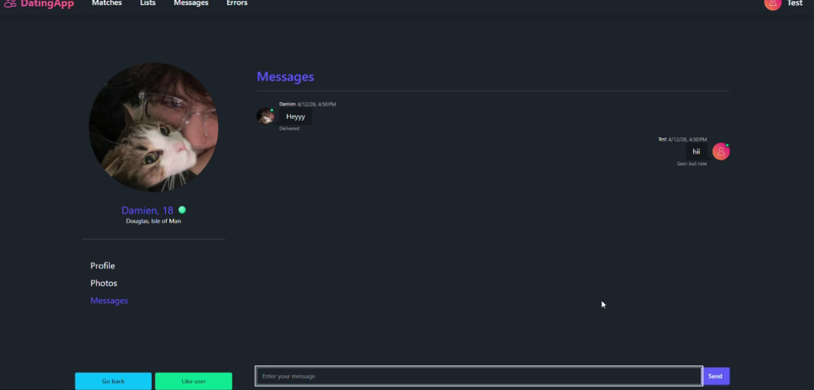
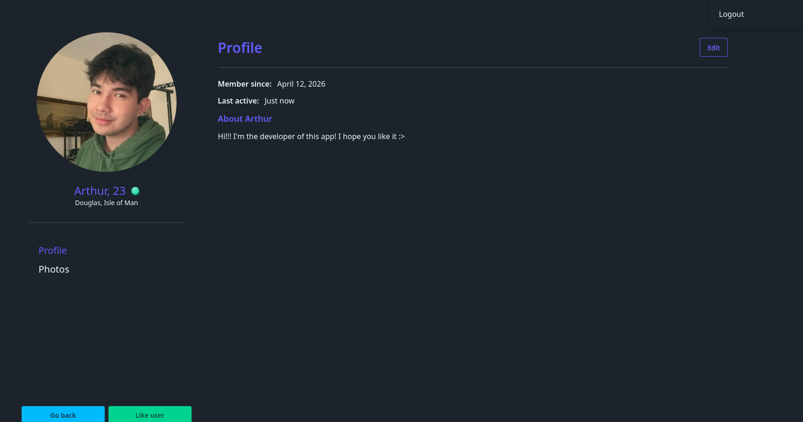
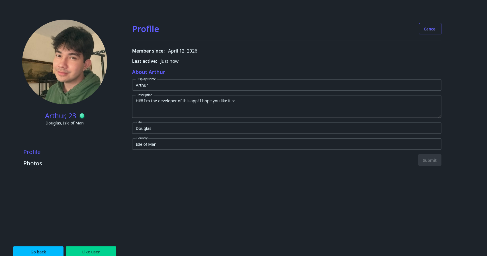
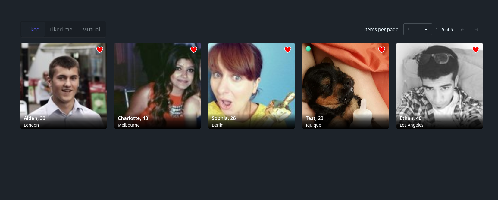

# 💘 Dating App

A full-stack dating application built with **.NET Web API**, **Angular**, and **SignalR**.
Browse members, send likes, chat in real time, and manage your profile — all in a modern dark-themed SPA.

🌐 **[Live Demo](https://da-2026-ae.azurewebsites.net/)** — hosted on Azure (free tier, allow a minute for the DB to wake up)

> **Test accounts:**
> - Regular user: `olivia.brown@example.com` / `Pa$$w0rd`
> - Admin: `admin@test.com` / `Pa$$w0rd`
> - Or just register a new account!

---

## 📦 Technologies

- **Backend**
  - .NET Web API
  - Entity Framework Core
  - MSSQL Server
  - ASP.NET Identity (role-based auth: User, Moderator, Admin)
  - SignalR (real-time messaging & presence)
  - Azure App Service (hosted)

- **Frontend**
  - Angular (SPA)
  - Tailwind CSS

- **Tools**
  - Git
  - Azure deployment

---

## ✨ Features

### Member browsing
- Browse all members with **filtering** by gender and minimum age
- Real-time **presence indicator** on member cards (online/offline)
- Detailed member profiles with photo galleries

### Likes system
- Like members you're interested in
- Three views on the Likes page: **Who you like**, **Who liked you**, **Mutual matches**

### Real-time messaging
- Full inbox powered by **SignalR** — messages appear instantly without page refresh
- Conversation history per member

### Profile management
- Edit your profile details
- Photo management with upload support
- Set a main profile photo

### Admin panel
- **User management** — view and manage all registered user's roles
- **Role editing** — assign and remove Moderator/Admin roles

---

## ⚠️ Known Limitations & Planned Improvements

- Desktop only — mobile layout not yet implemented
- Photo upload currently only supports drag and drop (click-to-upload coming)
- Validation error styling on the registration form needs polish
- Photo management UI has room for improvement
- Tested and working on **Chrome/Brave**, **Firefox/Zen**, and **Edge** — some styling issues observed on Opera and Opera GX (may be browser or device specific)

---

## 🖼️ Screenshots

### Member Browse — Unfiltered

### Member Browse — Filtered

### Likes — Who You Like

### Likes — Who Liked You

### Likes — Mutual Matches

### Messaging

### Member Profile

### Profile — Edit

### Profile — Photos

### Liked Example

### Admin — User Management

### Admin — Role Editing

---

## 🧠 Architecture Highlights

- Pure **SPA architecture** — Angular frontend consuming a .NET Web API
- **SignalR hubs** for real-time chat and online presence tracking
- **Role-based authorisation** via ASP.NET Identity (User / Moderator / Admin)
- Repository pattern
- EF Core with MSSQL, deployed to Azure
- JWT authentication (course-mandated — see notes)

---

## 📝 Notes

### On JWT Authentication

This project uses JWT for authentication because the course required it. In hindsight, and having looked into this more deeply, I think this was the wrong call for a web application like this — and I won't be repeating it.

The core problem is where JWTs end up being stored. You have two options and both are bad:

**Store in a cookie** — now you have basically reinvented session cookies, except with a token that's ~75x larger, carries all the user's data around on every request, and is significantly harder to revoke. You haven't gained anything over a plain session cookie except complexity and bandwidth.

**Store in localStorage** — this sidesteps the cookie problem but opens you up to XSS (cross-site scripting) attacks. localStorage is a pure JavaScript API, which means any malicious or compromised third-party script on your page — a CDN, an analytics tool, a tracking pixel — can read everything in it and exfiltrate your tokens. OWASP explicitly recommends never storing sensitive information in localStorage for this reason.

The revocation problem is also significant. If a token is compromised or a user needs to be forcibly logged out, your only real option without a server-side blocklist is to rotate the signing key — which logs *everyone* out. If you implement a blocklist to get around this, you've just re-centralised everything and you're now making a database call on every request anyway, which completely defeats the stated performance benefit of JWTs.

In practice, JWTs make sense for **short-lived, single-use flows** — a password reset link in an email, an external login handoff between domains, anything that is consumed once and immediately discarded. That is what the spec was actually designed for. Using them as a persistent session mechanism for a web application is a misuse of the format that the security industry popularised largely for marketing reasons.

**Future projects will use session cookies.** 

[Video where I learned this from](https://www.youtube.com/watch?v=JdGOb7AxUo0&t=12s)

---

## 💭 Planned Improvements

- Click-to-upload photos (currently drag and drop only)
- Mobile responsive layout
- Registration form validation error styling
- Photo management admin addition
